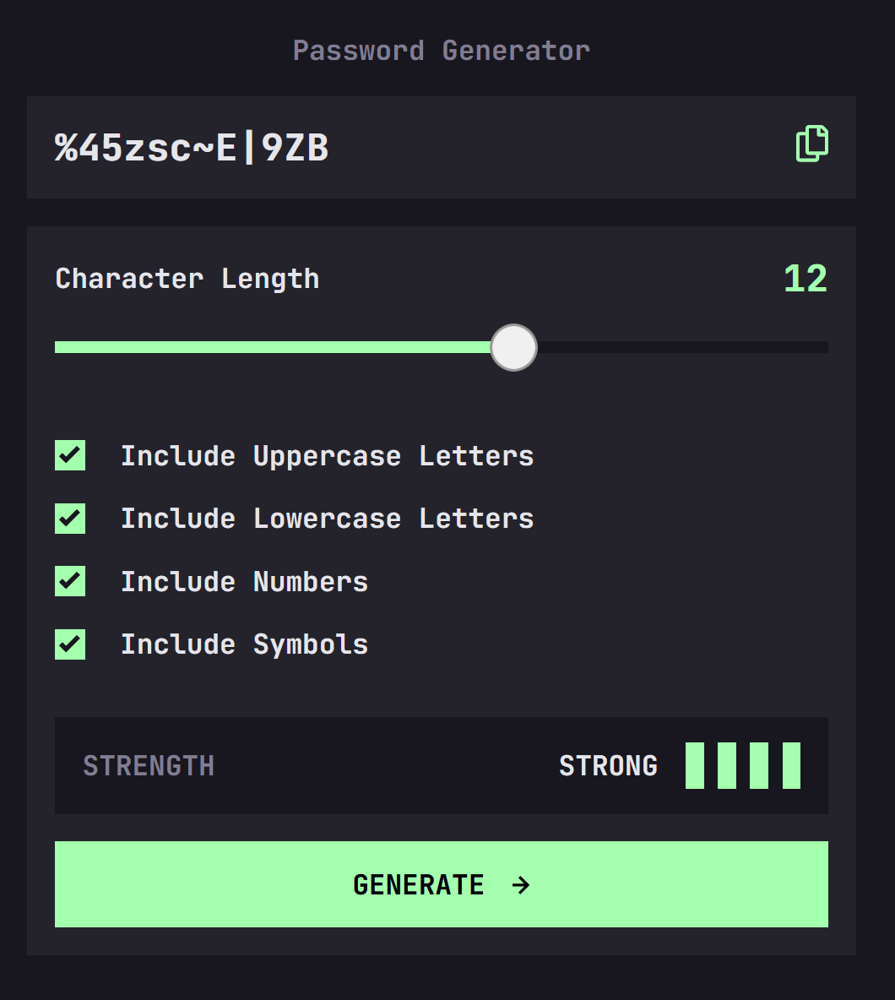

# Frontend Mentor - Password generator app solution

This is a solution to the [Password generator app challenge on Frontend Mentor](https://www.frontendmentor.io/challenges/password-generator-app-Mr8CLycqjh). Frontend Mentor challenges help you improve your coding skills by building realistic projects.

## Table of contents

- [Overview](#overview)
  - [The challenge](#the-challenge)
  - [Screenshot](#screenshot)
  - [Links](#links)
- [My process](#my-process)
  - [Built with](#built-with)
  - [What I learned](#what-i-learned)
  - [Continued development](#continued-development)
  - [Useful resources](#useful-resources)
- [Author](#author)

## Overview

### The challenge

Users should be able to:

- Generate a password based on the selected inclusion options
- Copy the generated password to the computer's clipboard
- See a strength rating for their generated password
- View the optimal layout for the interface depending on their device's screen size
- See hover and focus states for all interactive elements on the page

### Screenshot



### Links

- Live Site URL: [Password Generator App - Netlify](https://63226cf0dd68dd1a91297ef1--fastidious-cuchufli-432d64.netlify.app/)

## My process

### Built with

- Semantic HTML5 markup
- CSS custom properties
- Flexbox
- Mobile-first workflow
- CSS Module
- [React](https://reactjs.org/) - JS library
- [Next.js](https://nextjs.org/) - React framework


### What I learned

This is my first project using TypeScript, which is hard but useful (and sometimes annoying). This allows me to better understand what I want the code to accomplish. One trick that is worth noting is that if you have ever encountered the error ```Element implicitly has an 'any' type because expression of type 'string' can't be used to index type … ``` when trying to access an object property using string index, the easy fix would be add ```[key:string]: any``` to the object’s interface. 

Working on this project also reinforces my knowledge of NextJS. One interesting thing I learned was that you cannot add a class to a 'next/image' element. Stack Overflow has two suggestions regarding how to resolve this issue. The first one is to use ‘next/future/image` but it does not seem to work. The second one is to transform a svg image to React element and then change its properties directly in javascript, which is working very well in my situation. 


### Continued development

I need to learn more about TypeScript because (as I mentioned) it helps me to better understand my code. Moreover, most companies nowadays are using it. I I had more time to work on this project, I would probably add user log-in feature that allow user to save their password for latter. It is a good chance to learn about authentication and a little bit about backend. 

### Useful resources
-using this tool: 

- [Transform SVG to React Component](https://react-svgr.com/playground/) - This helped me transforming a SVG image to React Component. I love it because it gives me the freedom to do a lot of thing with the image using Javascript.

## Author

- Website - [Minh Le](https://www.ledminh.dev)
- Frontend Mentor - [@yourusername](https://www.frontendmentor.io/profile/ledminh)
- Twitter - [@yourusername](https://twitter.com/MinhLe29056419/)